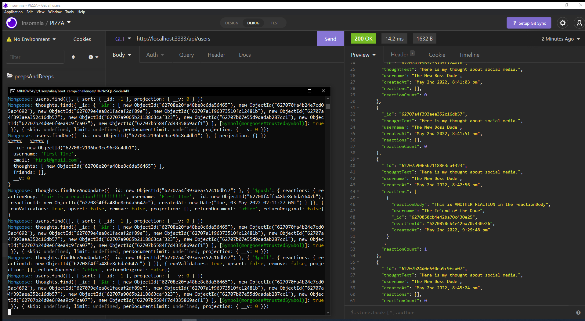

# Peeps & Deeps
## An application by H0RSESH0E  
&nbsp;  
  
&nbsp;&nbsp;  
## Table of Contents
#### [Description](#description)  -  [Installation](#installation)  -  [Usage](#usage) - [License](#license) - [Contributing](#contributing) - [Tests](#tests) - [Questions](#questions)
&nbsp;  
## Description  
This application uses Express.js and MongoDB (and the Mongoose ODM) to manage the backend of a social media site.  It tracks users, their friends, thoughts and reactions to those thoughts.  Please follow the link below the screenshot for a demonstration of the applications functionality.  
&nbsp;  
    
    
&nbsp;  
[Application Demonstration Video 1](https://drive.google.com/file/d/1LBFeZ8eAsp4_17Wrg8hmtjUZLGdfSOcX/view)  
&nbsp;  
[Application Demonstration Video 2](https://drive.google.com/file/d/1wJtL0aRlptKsP4zkrQItjqBDu0KwJ8w7/view)

&nbsp;  

## Installation
After downloading and installing MongoDB, download all necessary npm packages 'npm i' and then laucnch the server with 'node server.js'  
&nbsp;  
## Usage
There is no special usage information.  
&nbsp;  
## License  

**Eclipse Public License 2.0**  
This commercially-friendly copyleft license provides the ability to commercially license binaries; a modern royalty-free patent license grant; and the ability for linked works to use other licenses, including commercial ones.  
[View the full license here.](./LICENSE/license.txt)  
&nbsp;  
## Contributing
Please fork and use this application with no gauranteess.  It is not being maintained.  
&nbsp;  
## Tests
N/A  
&nbsp;  
## Questions
Questions or concerns about the project or how to contribute to its development can be emailed to: **dcpb777@gmail.com**  
&nbsp;  
&nbsp;  
  
  
**[Visit me on GitHub](https://github.com/H0RSESH0E)**  
